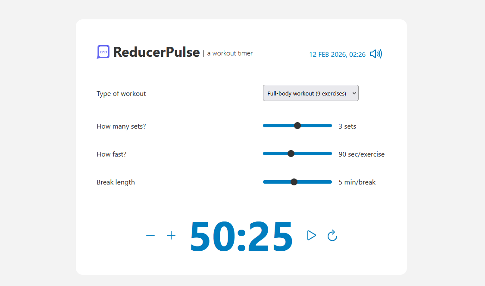

<h1>🚀 ReducerPulse</h1>

https://reducerpulse.netlify.app/

  A simple workout interval timer built with React.

This project demonstrates how to use:

- `useReducer` for state management
- `Context API` for global state sharing
- `useMemo` for performance optimization

The goal is to showcase scalable state patterns without using external libraries like Redux.

## 🛠 Build With:

- React JS
- Semantic HTML5 markup
- CSS Flexbox and Grid
- Mobile-first workflow
- Custom CSS properties
